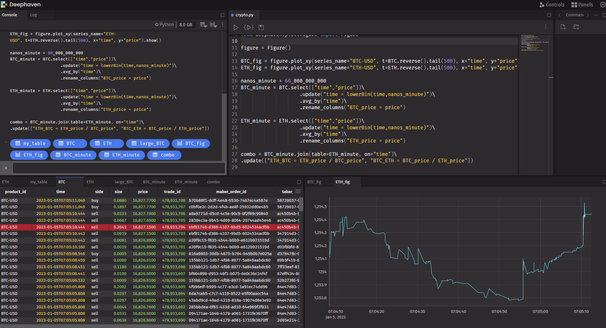

## Get dynamic Bitcoin data in real time with Python with Deephaven

From the youtube tutorial '[Get Dynamic Bitcoin Data in REAL TIME with Python - Intro to Deephaven - LINUX OS!!!](https://www.youtube.com/watch?v=wmalqABbkXU)'.  

**Thanks to Mariya youtube [channel](https://www.youtube.com/@PythonSimplified) 'Python Simplified'!!!**.  

Adapted scripts to set up environment and run the Deephaven example application in a windows 10/11 environment.



### Install and run from command line:

You can run the script _00_install_and_start.cmd_ or do the thing manually following the next steps.

* Create and activate a virtual environment:

```
virtualenv --no-setuptools venv
venv\Scripts\activate.bat
```
  
* Now that we are in the virtual environment, do some set up and start the application:  

```
set JAVA_HOME="C:\Program Files\Java\jdk11"
set PATH=C:\Program Files\Java\jdk11\bin;%PATH%
pip install --upgrade pip
pip install deephaven-example-app
python -m deephaven_example_app
```

Then open an [internet browser](http://localhost:10000/ide/) or from another windows shell execute:

```
explorer http://localhost:10000/ide/
```

### Scripts provided:

* _00_install_and_start.cmd_  
	Make the same that is described in the 'Install and run from command line' section.

* _01_start_local_server.cmd_  
	Star the Deephaven example application.
